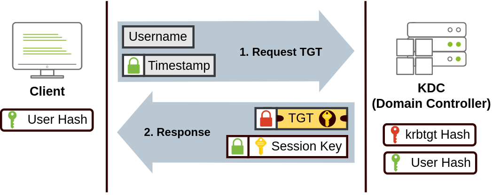
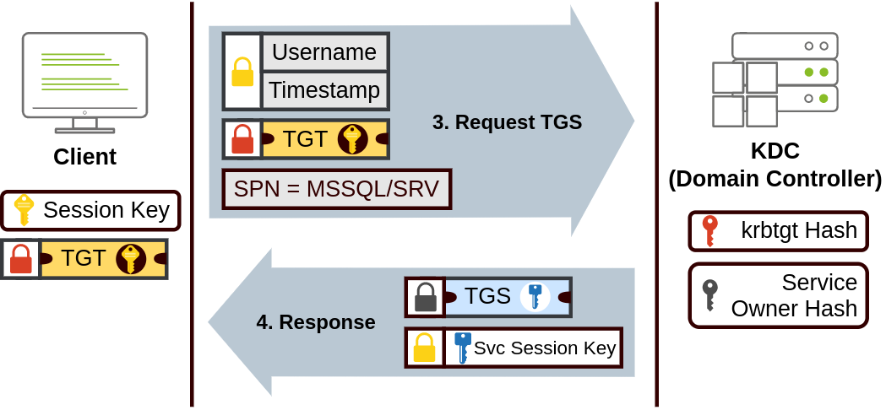
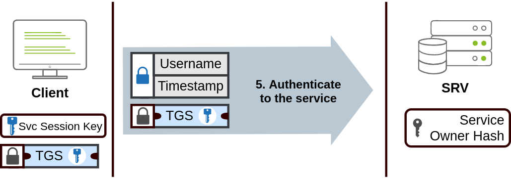
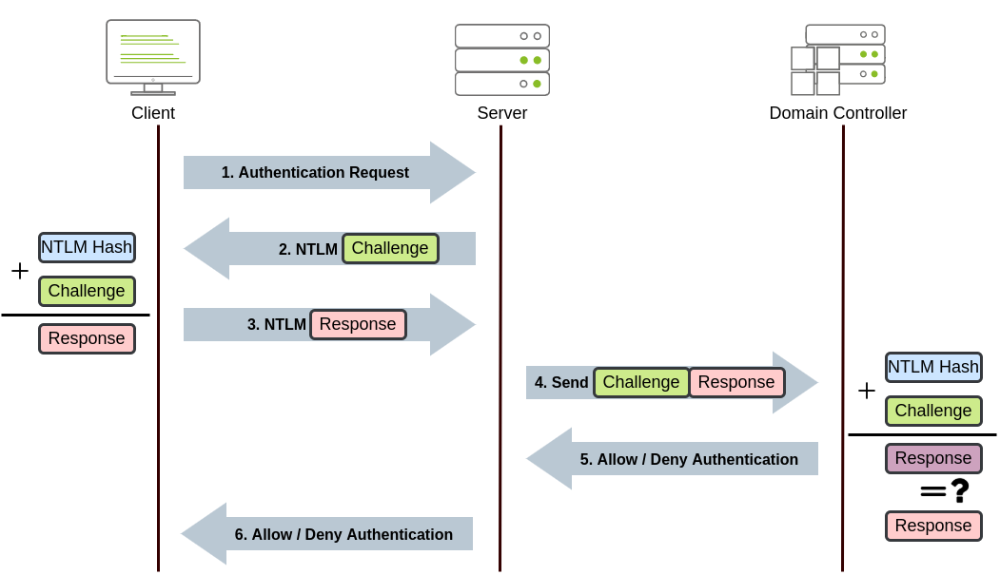
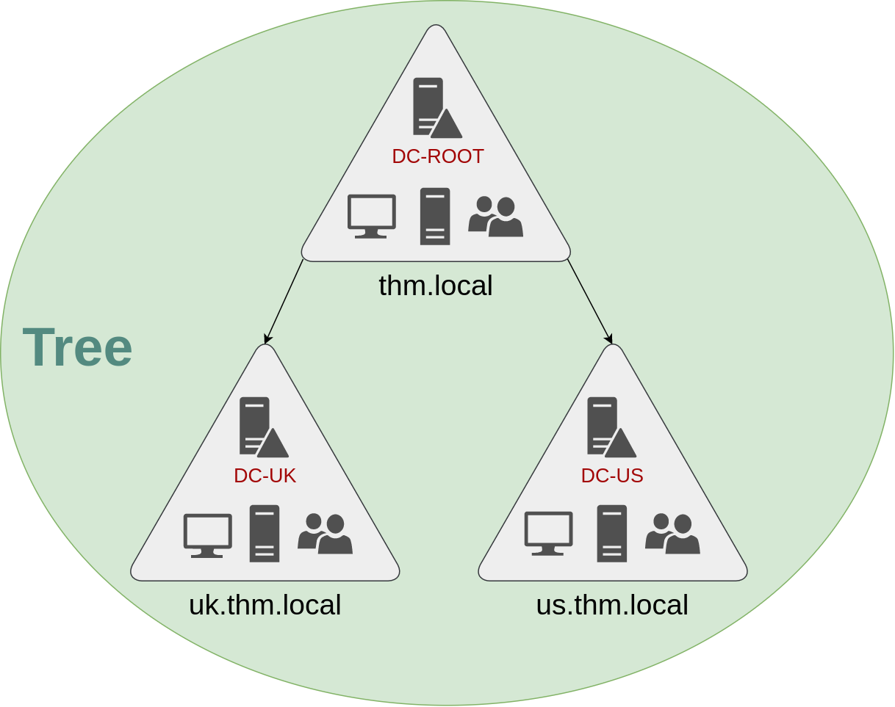
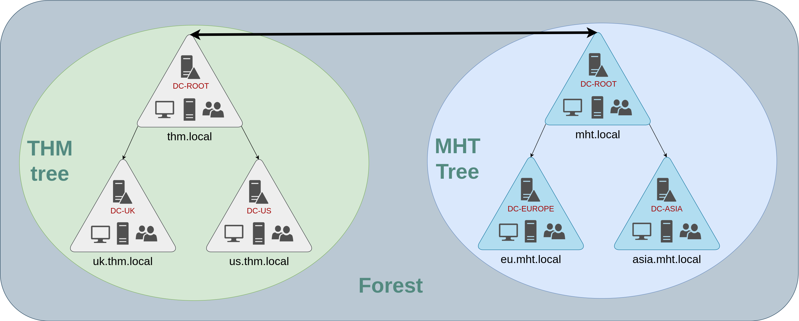
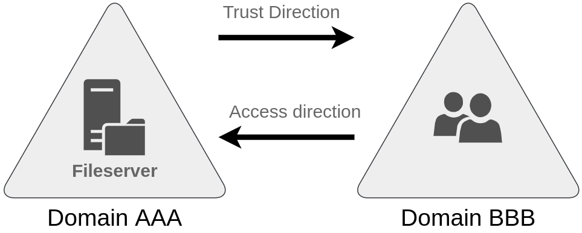

## Windows Domains

A Windows Domain is a group of users and computers that are under the administration of a given business. The reason we need this is that administration of a small group of on-site users is easy, a business with 5 employees doesn't require any sort of domain since you can easily configure policies and set up the workstation for each user individually.

However for large businesses this approach isn't feasible at all, this is why Windows Domains are needed. The main idea behind a domain is to centralise the administration of common components of a Windows computer network in a single repository called Active Directory (AD). The server that runs the services for Active Directory is known as the Domain Controller (DC). By having a configured Windows domain, a business can benefit from:

- Centralised identity management: All users across the network can be configured from Active Directory with minimum effort.
- Managing security policies: You can configure security policies directly from Active Directory and apply them to users and computers across the network as needed.

A good example to think about in general are Universities/School, for example in the case of TUM each student gets a TUM Identifier/TUM Email, and that one identity is what gets you into all of TUM's services, the Online Campus system, TUM's Linux servers over at the LRZ, and so on. Whenever I log into one of these, the login forwards back to Active Directory behind the scenes, and that's where my actual credentials get checked.

On top of that, TUM's AD also sets policies and restricts what users can do, so for example only authorized users (professors, whoever's actually responsible) are allowed to view exam papers or set exam grades, not just anyone with a TUM login.

## Active Directory Domain Services (AD DS)

The core of any Windows Domain is the Active Directory Domain Service (AD DS). This service acts as a catalogue that holds the information of all the "objects" that exist on your network. Amongst the many objects supported by AD, we have users, groups, machines, printers, shares and many others.

### Users

One of the most common object types in AD. Users are one of the objects known as Security Principals, because Users can be authenticated by the domain and can be assigned privileges over resources too. In short, a security principal is an object that can act upon resources in the network. Users can represent two types of entities:

- People: users will generally represent persons in your organisation that need to access the network, like employees.
- Services: you can also define users to be used by services like IIS or MSSQL. Every single service requires a user to run, but service users are different from regular users as they will only have the privileges needed to run their specific service.

### Machines

Another type of object in AD, for every computer that joins the Active Directory domain, a machine object will be created. Machines are also considered security principals and are assigned an account just as any regular user. The machine accounts are local administrators on the assigned computer. The passwords for machine accounts are generally rotated out and comprise of 120 random characters. Machine accounts in AD follow a specific naming scheme, the machine account name is the computer's name followed by a dollar sign. For example, a machine named DC01 will have a machine account called DC01$.

### Security Groups

In Windows, you can define User Groups and assign Users to these groups, any User who is part of such a User Group will gain the access rights that the Group has, this makes things easier since you can just assign/control the rights of the Group and every User in that group is affected. Security groups are also considered security principals and therefore can have privileges over resources on the network. In AD, both Users and Machines can be members of a group, and groups can also be part of other groups. Several groups are created by default in a domain that can be used to grant specific privileges to users. As an example, here are some of the most important groups in a domain:

| Security Group     | Description                                                                                                                                               |
| ------------------ | --------------------------------------------------------------------------------------------------------------------------------------------------------- |
| Domain Admins      | Users of this group have administrative privileges over the entire domain. By default, they can administer any computer on the domain, including the DCs. |
| Server Operators   | Users in this group can administer Domain Controllers. They cannot change any administrative group memberships.                                           |
| Backup Operators   | Users in this group are allowed to access any file, ignoring their permissions. They are used to perform backups of data on computers.                    |
| Account Operators  | Users in this group can create or modify other accounts in the domain.                                                                                    |
| Domain Users       | Includes all existing user accounts in the domain.                                                                                                        |
| Domain Computers   | Includes all existing computers in the domain.                                                                                                            |
| Domain Controllers | Includes all existing DCs on the domain.                                                                                                                  |

## Organizational Units (OUs)

Users, computers and groups all get organised in the domain hierarchy inside Organizational Units (OUs), which are container objects that let you classify users and machines. A user can only be part of a single OU at a time.

Basically think of OUs as folders, a person can only physically sit inside one folder at once, not two folders at the same time. So if an employee moves from Sales to IT, they get moved out of the Sales OU folder and into the IT OU folder, they're never sitting in both at once.

If you open any OU, you can see the users it contains and perform simple tasks like creating, deleting or modifying them as needed. You can also reset passwords if needed. There are also other default OUs that Windows creates automatically and contain the following:

- Builtin: Contains default groups available to any Windows host.
- Computers: Any machine joining the network will be put here by default. You can move them if needed.
- Domain Controllers: Default OU that contains the DCs in your network.
- Users: Default users and groups that apply to a domain-wide context.
- Managed Service Accounts: Holds accounts used by services in your Windows domain.

### OUs vs Security Groups

So what's the actual difference between the two, since on the surface they both seem to just be "ways of grouping stuff":

- OUs are for applying policies. A policy is a specific configuration that applies to a set of users or computers depending on their role, so for example everyone in the Sales OU might get a policy that locks their screen after 5 minutes, while IT's OU gets a longer timeout since they're constantly stepping away to fix things. This is also exactly why a user can only be in one OU at a time, it wouldn't make sense to try and apply two conflicting sets of policies to the same person at once.
- Security Groups are for granting permissions over resources, not applying policies. So if I want a few specific people from different departments to be able to access a shared drive or a network printer, I'd put them all into a group and give that group access, rather than relying on whatever OU they happen to sit in. Unlike OUs, a user can be a member of as many groups as needed, since someone might need access to five different shared resources at once.

### Deleting and Delegating OUs

By default, OUs are protected from accidental deletion. To delete an OU, you need to enable Advanced Features, this shows some additional containers and lets you disable the accidental deletion protection. To do this, right-click the OU, go to Properties, and there's a checkbox in the Object tab to disable the protection. Once that's off, you can delete the OU.

Delegation in AD gives specific users some control over specific OUs, letting you grant users specific privileges to perform advanced tasks on OUs without needing a Domain Admin to step in every time. To delegate control of a user over an OU, you right-click the OU (not the user) and select Delegate Control.

## Device Categories

By default, all machines that join a domain (except DCs) get put in the Computers container. But dumping every device into one container isn't good practice, chances are you want different policies for your servers versus the machines regular users are on day to day. The general idea is to segregate devices by what they're actually used for. You'd usually expect at least these three categories:

1. Workstations: The most common device in a domain. Every user logs into one of these to do their actual work or normal browsing. A workstation should never have a privileged account signed into it, since that turns a single compromised machine into a much bigger problem.
2. Servers: The second most common device type. These provide services to users or to other servers, rather than being something a person sits down at directly.
3. Domain Controllers: The third category, and the one that actually runs and manages the AD domain itself. These are considered the most sensitive machines on the whole network, since they hold the hashed passwords for every user account in the environment.

## Group Policy Objects (GPO)

Group Policy Objects (GPOs) are a collection of settings that get applied to OUs. A GPO can contain policies aimed at users, computers, or both, which lets you set a consistent baseline across specific machines and specific identities without touching each one by hand. Some concrete examples: a GPO could force a minimum password length and lockout policy across the whole domain, push out a specific desktop wallpaper and disable Control Panel access for a Students OU, map a network drive automatically for everyone in Sales, or set a stricter screen lock timeout for machines in IT versus general Workstations. To actually configure GPOs, you use the Group Policy Management tool.

Opening it up shows the whole OU hierarchy. To set up a policy you first create a GPO under Group Policy Objects, then link it to the OU you want it to apply to. 

Each GPO has a Scope tab (where it's linked in the AD, plus Security Filtering, which by default applies to Authenticated Users, meaning everyone), and a Settings tab, the actual content, split into Computer Configuration and User Configuration since some settings only make sense for one or the other. 

To edit one, right-click the GPO and hit Edit, which opens a full tree of every configurable setting. I changed the minimum password length under Computer Configuration -> Policies -> Windows Settings -> Security Settings -> Account Policies -> Password Policy. There's way too many policies to go through one by one, each one has an Explain tab if you double-click it that spells out what the setting actually does instead of having to guess.

## GPO Distribution (SYSVOL)

GPOs get distributed across the network through a share called SYSVOL, which lives on the DC. Every user in the domain needs access to this share so their machine can periodically pull down the latest GPOs. By default SYSVOL points to `C:\Windows\SYSVOL\sysvol\` on each DC.

The catch is that changes aren't instant, once you edit a GPO it can take up to 2 hours before every computer on the network has actually picked up the change, since machines only check in periodically rather than getting pushed the update immediately. So if I changed that password policy above and then immediately tried to test it on a random workstation, it's entirely possible nothing changed yet just because that machine hasn't synced. If I need a specific machine to grab the update right now, I can force it manually:

```powershell
gpupdate /force
```

That tells the local machine to go pull the latest GPOs from SYSVOL right away instead of waiting for its next scheduled check-in.

## Network Authentication Protocols

When you're on a Windows domain, all the actual credentials live on the Domain Controllers, not on the individual machines. So whenever someone tries to log into a service using their domain account, that service can't just check the password itself, it has to go ask the DC whether the credentials are actually correct. Two protocols handle this back and forth:

- Kerberos: the default on any modern version of Windows.
- NetNTLM: the older, legacy protocol kept around purely for compatibility with things that still need it.

### Kerberos Authentication

Kerberos is the default authentication protocol on any recent version of Windows. The easiest way to think about it: instead of proving who you are every single time you want to touch a new service, you prove it once, get handed something like a stamped ticket, and then just show that ticket around instead of your actual password.

**Step 1, getting your first ticket**

When I log in, my machine sends my username plus a timestamp encrypted with a key derived from my password over to the Key Distribution Center (KDC), a service that runs on the DC and hands out these tickets. If that checks out, the KDC gives back two things: a Ticket Granting Ticket (TGT), and a Session Key. The TGT is basically my "I already proved who I am" pass, I'll use it to ask for more specific tickets later without having to retype my password every time. The TGT itself is locked with the krbtgt account's password hash, so I can't actually open it and read what's inside, I just get to carry it around. It also contains a copy of that Session Key inside its encrypted contents, so the KDC never has to store the Session Key separately, it can just decrypt the TGT again later if it needs it.



**Step 2, getting a ticket for a specific service**

Say I want to connect to a specific share, website or database. I don't use my TGT directly against that service, instead I take my TGT back to the KDC and ask for a Ticket Granting Service (TGS) ticket, scoped to that one specific service. To ask for it, I send my username and a timestamp (this time encrypted with the Session Key from step 1), plus my TGT, plus a Service Principal Name (SPN) telling the KDC exactly which service and server I'm trying to reach. In return the KDC hands me a TGS plus a Service Session Key. This TGS is locked with a key derived from the Service Owner's password hash (the Service Owner being whatever account the target service actually runs under), and it also carries a copy of that Service Session Key inside it, so the service itself can unlock it when the time comes.



**Step 3, actually using the ticket**

Now I hand that TGS over to the service I actually wanted to reach. The service decrypts it using its own account's password hash, pulls out the Service Session Key, confirms everything checks out, and the connection goes through.



### NetNTLM Authentication

NetNTLM works completely differently, it's a straight challenge-response instead of tickets:

1. I send an authentication request to whatever server I'm trying to reach.
2. The server throws back a random number as a challenge.
3. My machine combines my NTLM password hash with that challenge (plus some other known data) to produce a response, and sends that back.
4. The server doesn't check this itself, it forwards both the challenge and my response over to the Domain Controller.
5. The DC redoes the same calculation using the challenge, and compares its answer against what I sent. Match means I'm authenticated, no match means access denied, either way it tells the server the result.
6. The server passes that result back to me.



Across both protocols, the actual password, or even the password hash, never gets sent across the network. Kerberos only ever moves encrypted tickets around, NetNTLM only ever moves a challenge and a derived response, never the hash itself.

## Growing Past a Single Domain

As companies grow, so does their network, and at some point having just the one domain stops being enough. A single domain means one flat set of policies and effectively one team responsible for the whole thing, and that stops scaling once the business spans different regions, different legal requirements, or different IT teams that shouldn't be stepping on each other's toes.

### Trees

Say the company suddenly expands into a new country. That country has its own laws and regulations that require different GPOs, and now there's an IT team in each country, each of whom needs to manage their own region's resources without interfering with the other team's. You could try to solve this with a huge OU structure and a pile of delegations, but that gets messy and error-prone fast as the AD structure grows.

Instead, AD lets you join multiple domains that share the same namespace into a Tree. So if thm.local expanded into a UK branch and a US branch, you'd end up with a root domain of thm.local, and two subdomains, uk.thm.local and us.thm.local, each with its own AD, its own computers, and its own users.



The Enterprise Admins group will grant a user administrative privileges over all of an enterprise's domains. Each domain would still have its own Domain Admins with administrator privileges over their single domains, and the Enterprise Admins who can control everything in the enterprise.

### Forests

Now say the company keeps growing and ends up acquiring another company entirely. When two companies like that merge, they're almost certainly not going to be on the same namespace, each one's probably already running its own domain tree with its own IT department. Joining several trees that have different namespaces together into the same network is what's called a forest.



So the hierarchy goes: 
domain 
then tree (multiple domains sharing one namespace) 
then forest (multiple trees with different namespaces, all tied together).

## Trust Relationships

Having multiple domains organised in trees and forests allows you to have a nice compartmentalised network in terms of management and resources. But at a certain point, a user at THM UK might need to access a shared file on one of MHT ASIA's servers. For this to happen, domains arranged in trees and forests are joined together by trust relationships.

In simple terms, having a trust relationship between domains allows you to authorise a user from domain THM UK to access resources from domain MHT EU.

The simplest trust relationship that can be established is a one-way trust relationship. In a one-way trust, if Domain AAA trusts Domain BBB, this means that a user on BBB can be authorised to access resources on AAA.



The direction of the one-way trust relationship is contrary to that of the access direction.

Two-way trust relationships can also be made to allow both domains to mutually authorise users from the other. By default, joining several domains under a tree or a forest will form a two-way trust relationship.