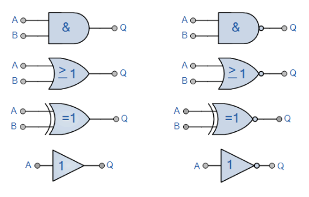
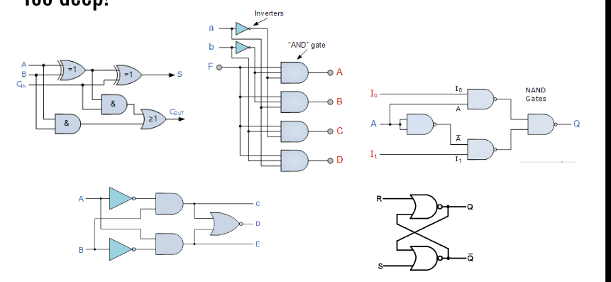
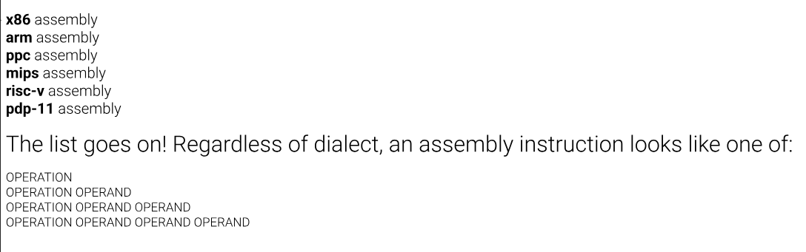
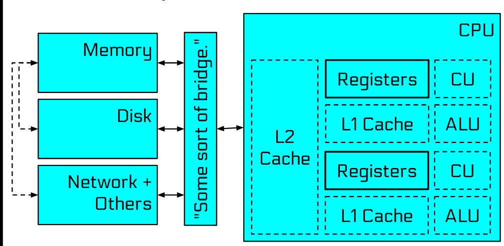
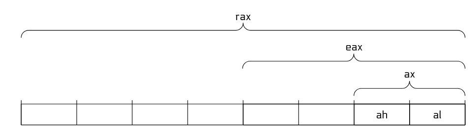

Computers run computer programs to achieve different goals, these computer programs are written using computer code, basically computer code is the sequence of many computer/machine instructions that cause the computer to carry out different computations.

This computation is done by the _Central Processing Unit_ (CPU), in tandem with other pieces of hardware inside your computer. Instructions are specified to the CPU in something called _Assembly Language_, and each CPU architecture uses a different flavor of this language. Any program, no matter what language it is originally written in (e.g., C, C++, Java, Python, etc.), is eventually converted to or interpreted by Assembly instructions.

### Crash Course in CA

All roads lead to the CPU, everything gets executed as binary/machine code. At the center of our CPU exists many logic gates that are the basis of all computation



Every one of these gates just takes one or two bits in and spits one bit out, and the whole of computation is built by wiring enough of them together. Here's what each of them actually does:

**NOT** — flips the bit, that's it.

| A | out |
|---|---|
| 0 | 1 |
| 1 | 0 |

**AND** — only 1 when both inputs are 1.

| A | B | out |
|---|---|---|
| 0 | 0 | 0 |
| 0 | 1 | 0 |
| 1 | 0 | 0 |
| 1 | 1 | 1 |

**OR** — 1 when at least one input is 1.

| A | B | out |
|---|---|---|
| 0 | 0 | 0 |
| 0 | 1 | 1 |
| 1 | 0 | 1 |
| 1 | 1 | 1 |

**XOR** (exclusive or) — 1 when the inputs are *different*.

| A | B | out |
|---|---|---|
| 0 | 0 | 0 |
| 0 | 1 | 1 |
| 1 | 0 | 1 |
| 1 | 1 | 0 |

**NAND** — AND with a NOT stuck on the end, so it's the inverse of AND.

| A | B | out |
|---|---|---|
| 0 | 0 | 1 |
| 0 | 1 | 1 |
| 1 | 0 | 1 |
| 1 | 1 | 0 |

**NOR** — OR inverted.

| A | B | out |
|---|---|---|
| 0 | 0 | 1 |
| 0 | 1 | 0 |
| 1 | 0 | 0 |
| 1 | 1 | 0 |

NAND and NOR are worth noting because they're *functionally complete*, i.e. you can build every other gate out of just NANDs (or just NORs). That's why real chips are largely made of them.

By combining these logic gates we can make several larger gates which are steps to performing such computations.



At a very high level, a 'basic' computer consists of a CPU, which over a hardware bridge communicates with other components which are part of the computer, such as the Memory, Network and Disk. The CPU itself consists of Registers (high speed storage units), Control Unit, ALU (Arithmetic Logic Unit), Caches (more storage units)

This is the concept for a single-core CPU, for a multi-core CPU, this scales up with each core having its own cache, registers, CUs, ALUs and so on.

**Von Neumann architecture**

Basically every computer you'll touch follows the architecture John von Neumann described in 1945. The key idea is that the program itself is stored in the same memory as the data it works on, i.e. there is one memory, one bus, and the CPU just fetches from it.

The important consequence is that **the machine doesn't distinguish between code and data at all**. A byte in memory is just a byte, whether it's the number 42 or an instruction. What decides which it is, is entirely how the CPU is pointed at it, if the instruction pointer lands on those bytes, they get executed, otherwise they're just data.

This is the whole reason we can write a compiler that outputs bytes and then run those bytes, but it's also the reason memory corruption attacks work at all, if you can get your own bytes into memory and then trick the CPU into pointing at them, they get executed as code. Everything in later pwn.college modules builds on this.

### Crash Course in Assembly

Since Binary/Machine code is hard to read and isn't really maintainable, a text representation of Binary exists, this is known as Assembly.

Assembly is named Assembly because it is 'assembled' into binary code by an assembler.

Assembly basically tells the CPU what to do, it does so via instructions, what do we want the instruction to do? This is communicated via the 'operation', and to communicate who this 'operation' should be done to, is communicated via the 'operand'

Assembly is the simplest programming language, but it is harder to program in general.

There are three types of Operands that the CPU deals with,
- data that the CPU receives as part of an instruction, i.e. data it's working on — these are **immediate values**, the number is baked into the instruction itself
- data that is close at hand — **registers**
- data that is in storage — **memory**

Some common assembly commands are
- add
- sub
- mul
- div
- mov
- cmp
- test

Assembly is a direct translation of the binary code ingested by the CPU, so for each different architecture, the Assembly code is different,



### Crash Course on Registers

CPUs are insanely fast, so to overcome the bottleneck that can be caused when waiting for data from much slower memory components, there exists registers, they help provide rapid data access to the CPU.



Registers are thus fast, temporary storage, they are very expensive to make and thus only a handful exist on the actual CPU chip. Registers are typically the size of the word width of the architecture, you can access registers by their name, or partially access them through their partial identifiers. In x86's modern incarnation, x86_64, programs have access to 16 general purpose registers.

The partial identifiers are basically just different sized windows onto the same physical register. Taking `rax` as the example:

| Name | Size | What it covers |
|---|---|---|
| `rax` | 64-bit | the whole register |
| `eax` | 32-bit | the lower half |
| `ax` | 16-bit | the lower quarter |
| `ah` | 8-bit | the *high* byte of `ax` |
| `al` | 8-bit | the *low* byte of `ax` |

So they're all the same piece of silicon, just addressed at different widths. If you write to `al`, you've changed the bottom 8 bits of `rax` too.

The same naming pattern holds for the others, `rbx`/`ebx`/`bx`/`bh`/`bl`, and so on. The newer registers `r8` through `r15` use a different scheme, `r8`/`r8d`/`r8w`/`r8b` for 64/32/16/8 bit.

One gotcha worth remembering: writing to a 32-bit register like `eax` **zeroes the upper 32 bits** of `rax`, but writing to `ax` or `al` leaves the upper bits untouched. That inconsistency catches people out constantly.



To load data into registers with assembly, you use the `mov` command,

```
mov rax, 42
```

This puts the value 42 into `rax`. Data that is specified this way are known as Immediate Values, additionally you can load data into the partial parts of registers.

```
mov eax, 42        ; into the lower 32 bits
mov al, 42         ; into the lowest byte
```

Remember that the `mov` command doesn't physically move the data, but rather copies it, we can thus "move" data between registers too.

```
mov rdi, rax       ; copy whatever is in rax into rdi, rax keeps its value
```

**Extending Data**

There's a subtlety when you write a negative number into a partial register. Consider:

```
mov eax, -1
```

`eax` is now `0xffffffff` (which is both 4294967295 and -1 depending on how you read it) but `rax` is now `0x00000000ffffffff`, i.e. only 4294967295. The sign got lost, because the write to `eax` zeroed the top half.

So what if you wanted to operate on that -1 in 64-bit land? You use `movsx`:

```
mov eax, -1
movsx rax, eax
```

`movsx` does a **sign-extending** move, i.e. it copies the top bit of the source into the rest of the destination register, preserving the Two's Complement value. Now `rax` is `0xffffffffffffffff`, which is both 18446744073709551615 and -1.

There's also `movzx`, which does the same thing but **zero-extends** instead, i.e. fills the top with zeroes regardless of the sign bit. Use `movsx` when the value is signed, `movzx` when it isn't.

For most arithmetic registers, the first register specified in the instruction is the register where the result/output is stored

---

Typically, assembly files are stored in a .s file, usually if we code our Assembly Programs in such a way that we don't cleanly start or stop them, it can lead to crashes. This starting and stopping of programs is handled by the OS.

Your programs "interact" with the CPU using assembly instructions such as the `mov` instruction you wrote earlier. Similarly, your programs interact with the operating system (via the CPU, of course) using the `syscall`, or _System Call_ instruction.

Each system call is indicated by a _syscall number_, counting upwards from 0, and your program invokes a specific syscall by moving its syscall number into the `rax` register and invoking the `syscall` instruction.

Every program exits with an exit code. Similarly to how a system call number (e.g., `60` for `exit`) is specified in the `rax` variable, parameters are also passed to the syscall through registers. System calls can take multiple parameters, though `exit` takes only one: the exit code. The first parameter to a system call is passed via another register: `rdi`. Remember you can view the exit code of the last command by doing `echo $?`.

Now, to turn our written assembly programs into an executable binary, we convert our assembly file, .s into an object file using the `as` command. We then link one or more executable object files into a final executable binary (using the `ld` command)

We'll need to let the assembler know about the type of assembly code we've written, you do this by prepending a directive to the beginning of your assembly code, as such:

```console
hacker@dojo:~$ cat program.s
.intel_syntax noprefix
mov rdi, 42
mov rax, 60
syscall
hacker@dojo:~$
```

Next, we'll assemble the code. This is done using the **as**sembler, `as`, as so:

```console
hacker@dojo:~$ ls
program.s
hacker@dojo:~$ cat program.s
.intel_syntax noprefix
mov rdi, 42
mov rax, 60
syscall
hacker@dojo:~$ as -o program.o program.s
hacker@dojo:~$ ls
program.o   program.s
hacker@dojo:~$
```

In a typical development workflow, source code is compiled and assembly is assembled to object files, and there are typically many of these (generally, each source code file in a program compiles into its own object file). These are then _linked_ together into a single executable. Even if there is only one file, we still need to link it, to prepare the final executable. This is done with the `ld` (stemming from the term "**l**ink e**d**itor") command, as so:

```console
hacker@dojo:~$ ls
program.o   program.s
hacker@dojo:~$ ld -o program program.o
ld: warning: cannot find entry symbol _start; defaulting to 0000000000401000
hacker@dojo:~$ ls
program.o   program.s   program
hacker@dojo:~$
```

This creates an `program` file that we can then run! Here it is:

```console
hacker@dojo:~$ ./program
hacker@dojo:~$ echo $?
42
hacker@dojo:~$
```

