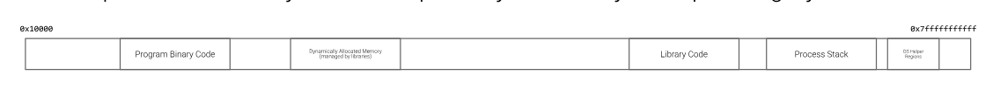
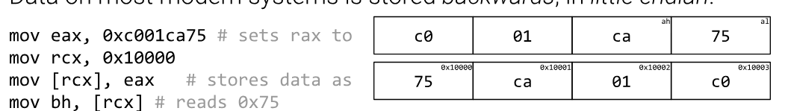

Since registers are expensive and we can only fit a limited amount of them on the physical CPU chip, we need a place to store data from which we can freely access this data whenever needed. This is known as System Memory

The core concept is that we want our memory as close as possible, i.e. we work on the registers for as long as possible before we need data from the System Memory.

**Process Memory**

Every process gets its own view of memory, i.e. its own address space. This is important, process A's address `0x1000` and process B's address `0x1000` are completely different pieces of physical RAM, the CPU's Memory Management Unit (MMU) translates between the virtual address the process sees and the physical address in the actual RAM chip. This is what stops one process from reading another's data.

**Each memory address references exactly one byte**

This is the single most important thing to internalise about memory. An address is not a slot that holds "a value", it holds exactly 8 bits. So address 133700 holds one byte, 133701 holds the next byte, and so on. Everything else, i.e. how we store a 64-bit number, follows from this.

**Why memory addresses don't start from 0**

You'd think address 0 would be the first usable byte, but it isn't, the bottom chunk of the address space is deliberately left unmapped. The reason is that null pointers are a bug, `NULL` is defined as 0, and if a program dereferences a null pointer you *want* it to crash immediately with a segfault rather than silently read garbage. If address 0 were valid memory, that bug would go unnoticed and produce wrong results instead of an obvious crash.

On Linux this is controlled by `vm.mmap_min_addr`, typically 65536, so the entire first 64KB is a guaranteed-invalid trap region. Same reason applies for small offsets, i.e. reading `[rax+8]` when `rax` is null still lands in the trap region and still crashes.

Not all of our memory is real, Virtual Memory exists, every process has its Virtual Memory Space, this Virtual Memory Space always starts out partially filled by the Operating System. The process's Program Data/Code goes somewhere, the dynamically allocated memory, i.e. the Heap is above the Data/Code segment. Above the Heap is the Process Stack.



### Stack

It is a region of memory, it is created when a process starts up. Registers and immediates can be pushed on to the stack and appropriately popped, the STACK is a LIFO data structure

To address the stack, the actual memory address of the stack is located in the `rsp` register, the stack grows backwards towards the smaller memory address, so pushing values on to the stack decreases `rsp` towards 0, whereas popping increases its (`rsp`) value away from 0.

### The other memory regions

**Code segment (.text)** — where the actual assembled instructions live. It's marked read+execute but *not* writable, so a program can't modify its own instructions at runtime. That's a deliberate defense, since a Von Neumann machine doesn't distinguish code from data, the OS has to enforce the distinction with page permissions instead.

**Data segment** — this splits into two:
- **.data** holds initialised globals, i.e. variables you gave a value to at compile time. Read+write.
- **.bss** holds uninitialised globals, it takes up no space in the actual binary file on disk, the OS just zeroes out the region when the process starts.

**Heap** — dynamically allocated memory, i.e. what you get from `malloc` in C. It grows *upwards* towards higher addresses. You ask the OS for more of it via the `brk`/`sbrk` or `mmap` syscalls.

**Stack** — as above, grows *downwards* towards lower addresses.

The reason heap and stack grow towards each other is so they can share the same free space in the middle, whichever one needs more gets it, rather than each having a fixed budget.

Worth noting for later: each region has different permissions, and the general shape of a memory corruption attack is getting your data into a region and then getting it treated as something it shouldn't be.

### Accessing memory addresses directly

To read the data *at* a memory address rather than the address itself, you **dereference** it, which in Intel syntax means wrapping it in square brackets `[]`.

```assembly
mov rax, 133700     ; rax now HOLDS the number 133700
mov rbx, [133700]   ; rbx now holds the VALUE STORED AT address 133700
```

The distinction is the whole thing. Without brackets you're moving the address itself, with brackets you're moving what's living there.

**Pointer terminology** — when a register holds a memory address, we say that register **points to** that address, and we call it a **pointer**. So in the example above `rax` is a pointer to 133700. Dereferencing a pointer means going to the address it holds and fetching what's there.

```assembly
mov rax, 133700     ; rax POINTS TO 133700
mov rbx, [rax]      ; go to where rax points, take that value, put it in rbx
```

This is exactly how pointers work in C, `rax` is `int *p`, and `[rax]` is `*p`.

### How a 64-bit value is actually stored

Since one memory address holds one byte, and a 64-bit value is 8 bytes, a single value has to spread across 8 consecutive addresses.

Say you store the value `0x1122334455667788` at address 133700. Memory looks like this (on a little-endian machine, more on that below):

| Address | Byte |
|---|---|
| 133700 | `0x88` |
| 133701 | `0x77` |
| 133702 | `0x66` |
| 133703 | `0x55` |
| 133704 | `0x44` |
| 133705 | `0x33` |
| 133706 | `0x22` |
| 133707 | `0x11` |

So `mov rax, [133700]` doesn't read one byte, it reads 8 bytes starting at 133700 and reassembles them into a 64-bit value. The *size of the destination register* is what determines how many bytes get read.

This is also why the next value in a sequence of 64-bit numbers is at 133708 and not 133701.

### Controlling write sizes

You control how much memory gets touched by choosing which register width you use, i.e. the partial registers from the previous module.

```assembly
mov rax, [133700]   ; reads 8 bytes  (133700 - 133707)
mov eax, [133700]   ; reads 4 bytes  (133700 - 133703)
mov ax,  [133700]   ; reads 2 bytes  (133700 - 133701)
mov al,  [133700]   ; reads 1 byte   (133700)
```

And the same going the other way, writing to memory:

```assembly
mov [133700], rax   ; writes 8 bytes
mov [133700], al    ; writes 1 byte, leaves 133701 onwards untouched
```

Remember the gotcha from module 1, writing to `eax` zeroes the top half of `rax`, but writing to `al` or `ax` leaves the upper bits alone. That applies here too when you're loading *from* memory into a partial register.

### Endianness

Data on most modern systems are stored in Little Endian, i.e. stored backwards. This endianness only applies to bytes, i.e. not to the individual bits of the bytes.



The rule is that the **least significant byte goes at the lowest address**. So `0x11223344` stored at address 100 gives you `44 33 22 11` reading forwards through memory.

The bits inside each byte are *not* reversed, `0x44` stays `0x44`, it doesn't become `0x22`. Only the byte order flips.

x86 and x86_64 are little endian. Network protocols are big endian (which is why it's called "network byte order"), so anything doing networking has to convert. This becomes very relevant when you're reading raw packet captures or crafting exploit payloads, if you want to write the address `0x401000` into memory you have to lay the bytes down as `00 10 40 00`.

### Address calculation

You don't have to hardcode an address, you can compute one inside the brackets. The general form is:

```
[base + index*scale + displacement]
```

Which in practice looks like:

```assembly
mov rax, [rdi]           ; base only
mov rax, [rdi+8]         ; base + displacement
mov rax, [rdi+rsi]       ; base + index
mov rax, [rdi+rsi*8]     ; base + index scaled by 8
mov rax, [rdi+rsi*8+16]  ; the whole thing
```

The scale exists specifically for arrays. If `rdi` points to an array of 64-bit values and `rsi` holds the index you want, then `[rdi+rsi*8]` gets you element `rsi` directly, because each element is 8 bytes wide. That's array indexing in one instruction.

**The limits of address calculation** are strict and worth memorising, because the assembler will reject anything outside them:

- **scale** can only be `1`, `2`, `4`, or `8`. Not 3, not 16. Those are the sizes of byte/word/dword/qword, which is the whole point.
- **displacement** must be a constant known at assemble time, you can't put a register there.
- you can't nest, i.e. `[[rax]]` is illegal. You need two instructions, one to load the pointer and one to dereference it.
- base and index must be full 64-bit registers, you can't mix `[rax+ebx]`.

**LEA — Load Effective Address**

`lea` does the address calculation but *doesn't* dereference, i.e. it gives you the computed address itself rather than what's stored there.

```assembly
mov rax, [rdi+8]    ; rax = the VALUE at rdi+8
lea rax, [rdi+8]    ; rax = the ADDRESS rdi+8
```

So `lea` is how you get a pointer to something rather than the something.

The sneaky use is that because it does arithmetic without touching memory, people use it as a fast calculator:

```assembly
lea rax, [rbx+rbx*4]    ; rax = rbx * 5, in one instruction
lea rax, [rbx+rcx+7]    ; rax = rbx + rcx + 7
```

### RIP and relative addressing

`rip` is the **instruction pointer**, it holds the address of the next instruction to execute. Every time an instruction runs, `rip` advances.

You can't `mov` to or from `rip` directly, i.e. `mov rax, rip` is not a valid instruction. The CPU controls it, and the only ways it changes are by executing instructions, or by jumps/calls/returns.

But you *can* address relative to it:

```assembly
lea rax, [rip+0x100]    ; rax = the address 0x100 bytes after this instruction
```

This is **RIP-relative addressing**, and `lea` is the standard way to use it. It matters because it makes code **position independent** — the instruction doesn't say "address 0x401000", it says "0x100 bytes ahead of wherever I currently am". So the whole binary can be loaded anywhere in memory and the addressing still works.

That's the foundation of PIE (Position Independent Executable) and therefore of ASLR (Address Space Layout Randomisation), i.e. the OS randomises where your program lands in memory so an attacker can't predict addresses. RIP-relative addressing is what makes that possible.

### Writing immediate values to memory

When you write a register to memory, the assembler knows the size from the register, i.e. `mov [rax], rbx` is obviously 8 bytes because `rbx` is 8 bytes.

But an immediate value has no inherent size, so this is **ambiguous and will not assemble**:

```assembly
mov [133700], 42        ; ERROR: how many bytes is 42?
```

You have to say explicitly:

```assembly
mov BYTE PTR [133700], 42     ; 1 byte
mov WORD PTR [133700], 42     ; 2 bytes
mov DWORD PTR [133700], 42    ; 4 bytes
mov QWORD PTR [133700], 42    ; 8 bytes
```

| Keyword | Size |
|---|---|
| `BYTE` | 8 bits |
| `WORD` | 16 bits |
| `DWORD` | 32 bits (double word) |
| `QWORD` | 64 bits (quad word) |

The "word" here is 16 bits for historical reasons, i.e. it comes from the original 16-bit 8086, and the naming stuck even though a modern x86_64 "word" in the architectural sense is 64 bits. Confusing, but you just have to remember it.

**The syntax depends on your assembler.** GNU `as` with `.intel_syntax noprefix` (what we're using) wants `mov DWORD PTR [addr], 42`. NASM wants `mov dword [addr], 42`, i.e. no `PTR`. 

---

Computers mostly store data in memory sequentially, or at least it tries to, to access data in memory, you simply move the data stored at that memory address, you do this by "dereferencing" it with `[]`, i.e. you place the memory address inside the square brackets, and move the value into a register such as `rdi`, remember that the value of `rdi` is the first parameter to the exit syscall. Remember that 60 is the specific syscall number for exiting. When writing a raw assembly program for Linux, it almost always ends by setting `rax` to 60 and `syscall`'ing, so for example:

```assembly
.intel_syntax noprefix
.global _start
_start:
mov rdi, [133700]
mov rax, 60
syscall
```

```console
$ as -o pwn.o pwn.s        # assemble
$ ld -o pwn pwn.o          # link the OBJECT file
$ ./pwn
$ echo $?
146
```

Moving memory addresses into a register causes that register to point to that memory address, so instead of doing

```assembly
mov rax, [133700]
```

we can do

```assembly
mov rax, 133700
mov rdi, [rax]
```

i.e. we dereference `rax` to load the data into `rdi`.

**Dereferencing a pointer that was handed to us**

Here the challenge sets up `rax` to already point somewhere, so all we do is dereference it:

```assembly
.intel_syntax noprefix
.global _start
_start:
mov rdi, [rax]
mov rax, 60
syscall
```

```console
$ echo $?
101
```

Note the ordering matters, `mov rdi, [rax]` has to happen *before* `mov rax, 60`, otherwise you've overwritten the pointer before using it.

In general you can use any register and dereference it if it contains the memory address, we can even do this with a register itself, for example:

```assembly
mov QWORD PTR [133700], 42
mov rax, 133700  # after this, rax will be 133700
mov rax, [rax]   # after this, rax will be 42
```

So `rax` is a pointer in line 2 and then is dereferenced and used as a general purpose register to store the value of the dereferenced memory address.

Same idea where the pointer arrives in `rdi`:

```assembly
.intel_syntax noprefix
.global _start
_start:
mov rdi, [rdi]
mov rax, 60
syscall
```

Sometimes a pointer may point to a collection of data rather than to a singular memory address. If, for example, `rdi` points to a sequence of 64-bit numbers starting from 133700, one can then access the second number by:

```assembly
mov rax, [rdi+8]
```

**Not `[rdi+1]`** — each memory address represents a specific byte, and a 64-bit number occupies 8 of them, so `[rdi+1]` would land you one byte into the *first* number, giving you garbage. The offset has to be in bytes, i.e. element `n` of an array of 64-bit values is at `[rdi + n*8]`.

```assembly
.intel_syntax noprefix
.global _start
_start:
mov rdi, [rdi+8]
mov rax, 60
syscall
```

Below would be an example of a double dereference, i.e. following a pointer to a pointer. Note that you can't do `[[address]]` directly:

```assembly
.intel_syntax noprefix
.global _start
_start:
mov rdi, [567800]    ; load the pointer stored at 567800
mov rdi, [rdi]       ; follow it
mov rax, 60
syscall
```

Two instructions because the address calculation can't nest. Line 1 gets you the pointer, line 2 dereferences it.