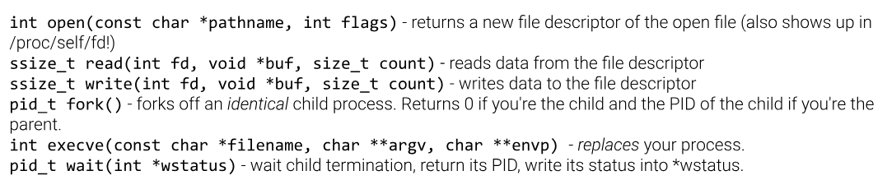

## System calls, in general

The `write` system call is used to `write` output to the command-line terminal. Remember that the `syscall` instruction triggers the system call specified by the value in the `rax` register. The syscall value for `exit` is 60, the syscall value for `read` is 0, the syscall value for `write` is 1 and the syscall for `open` is 2. Some examples of syscalls are:



### How a syscall actually works

A program on its own can only move values between registers and its own memory. It cannot touch a disk, a network card, or the terminal, because those belong to the kernel. Anything that crosses that boundary has to be a request, and the `syscall` instruction is how you make one.

The mechanism is a calling convention, nothing more. You fill in a set of agreed registers, execute one instruction, and the CPU switches into kernel mode and hands control to the kernel's syscall handler. The kernel reads `rax` to work out which service you asked for, reads the argument registers, does the work, and returns.

### The syscall argument order

1. **`rdi`**: 1st detail (Parameter 1)
2. **`rsi`**: 2nd detail (Parameter 2)
3. **`rdx`**: 3rd detail (Parameter 3)
4. **`r10`**: 4th detail (Parameter 4)
5. **`r8`**: 5th detail (Parameter 5)
6. **`r9`**: 6th detail (Parameter 6)

So the general shape is always the same, whatever the syscall:

| Register | Role |
| --- | --- |
| `rax` | which syscall (going in), return value (coming out) |
| `rdi`, `rsi`, `rdx`, `r10`, `r8`, `r9` | arguments 1 through 6, in that order |

Six is the hard maximum. There is no seventh register in the convention, so a syscall that needs more data than that takes a pointer to a struct instead.

Three things about this that are worth holding onto:

**You only fill in the arguments the syscall actually uses.** `exit` takes one argument, so only `rdi` matters and whatever is sitting in `rsi` is ignored. `write` takes three, so `rdi`, `rsi`, `rdx`. Registers past the ones the syscall reads can hold garbage and nothing cares.

**`rax` is used twice.** Before the `syscall` instruction it is the syscall number. After it, the kernel has overwritten it with the return value. This is why you can never assume `rax` still holds what you put there, and it is the single most common way to break a chain of syscalls.

### Return values and errors

The kernel reports success and failure in `rax`. On success it is whatever the call produces, a byte count, a file descriptor, a 0. On failure it is a small negative number, the negated error code. `-2` is `ENOENT` (no such file), `-13` is `EACCES` (permission denied), `-14` is `EFAULT` (you handed the kernel a bad pointer). If a program mysteriously prints nothing, checking `rax` after the syscall is the first thing to do, and `strace` from the last module shows the same value without any of the effort.

### Constant arguments

Several syscalls take arguments that are named constants in C rather than obvious numbers. `open`'s second argument is the clearest case: in C you write `O_RDONLY`, `O_WRONLY`, `O_RDWR`, `O_CREAT`, and so on. Those names do not exist at the assembly level. The assembler has never heard of `O_RDONLY`. All that reaches the kernel is a number, and the header file that defines the name is a convenience for C programmers only.

So in assembly you write the number:

| Constant | Value | Meaning |
| --- | --- | --- |
| `O_RDONLY` | `0` | read only |
| `O_WRONLY` | `1` | write only |
| `O_RDWR` | `2` | read and write |
| `O_CREAT` | `0x40` | create the file if it does not exist |
| `O_TRUNC` | `0x200` | truncate to zero length on open |
| `O_APPEND` | `0x400` | writes go to the end |

These are bit flags, so they combine with OR: `O_WRONLY | O_CREAT | O_TRUNC` is `1 | 0x40 | 0x200`, which is `0x241`. In assembly you either work that out yourself and write `mov rsi, 0x241`, or you define the names once at the top of the file so the source still reads sensibly:

```asm
.equ O_RDONLY, 0
.equ O_WRONLY, 1
.equ O_CREAT,  0x40

    mov rsi, O_WRONLY | O_CREAT
```

`.equ` is an assembler directive, so this is purely a naming convenience. The assembler substitutes the number and the resulting bytes are identical either way.

---

## The `write` syscall

The `write` system call needs, through its parameters, *what* data to write and *where* to write it to. To specify where to write data to, you specify the file descriptor, this is the first parameter to the `write` system call. If you want to write to standard output, you would set `rdi` to 1. If you want to write to standard error, you would set `rdi` to 2. For the "what" to write, the `write` system call takes in two parameters. Thus this would be:

```c
write(file_descriptor, memory_address, number_of_characters_to_write)
```

The important thing about that middle argument is that it is an **address**, not the data. You do not put the bytes into `rsi`. You put the address where the bytes already live, and the kernel reads them from your memory itself. If `rsi` holds something that is not a valid address, the syscall fails with `-14` (`EFAULT`) rather than crashing, because the kernel checks the pointer instead of blindly dereferencing it.

So the general steps to follow for the `write` system call are:

1. We pass the first parameter of a system call in the `rdi` register.
2. We'll pass the second parameter via the `rsi` register.
3. We'll pass the third parameter via the `rdx` register.


```asm
.intel_syntax noprefix
.global _start

_start:
mov rdi, 1
mov rsi, [rsp+16]
mov rdx, 1
mov rax, 1
syscall
```

`[rsp+16]` is `argv[1]`, straight from the stack layout in the previous module. It is a pointer to the first argument string, which is exactly the kind of value `write` wants in `rsi`. Note the square brackets: this is a load from memory, so `rsi` ends up holding the pointer that was stored at `rsp+16`, not the address `rsp+16` itself.

`rdx` is 1, so one byte gets written: the first character of the argument and nothing else.

```console
ubuntu@hello-hackers~writing-output:~$ /challenge/check pwn

Checking that your assembly writes a byte from the first argument...
Your assembly looks correct!

Let's run your program with different arguments to check that it writes a character!

hacker@hello-hackers~writing-output:/home/hacker$ pwn g
Segmentation fault
g
hacker@hello-hackers~writing-output:/home/hacker$ pwn Y
Segmentation fault
Y
hacker@hello-hackers~writing-output:/home/hacker$ pwn R
Segmentation fault
Rhacker@hello-hackers~writing-output:/home/hacker$

Wow, you wrote a character from the program's first argument to stdout!!!!!!! But why
did your program crash? Well, you didn't exit, and as before, the CPU kept executing
and eventually crashed. In the next level, we will learn how to chain two system
calls together: write and exit!
```

Two details in that output worth noticing.

The character appears with no newline after it, which is why the third run reads `Rhacker@hello-hackers...` with the shell prompt jammed onto the same line. Nothing added a newline, because nothing was asked to. `write` sends exactly `rdx` bytes and does no formatting whatsoever. A newline is just byte `0x0a` and you have to write it yourself if you want it.

The `Segmentation fault` line comes from the shell, not from the program. The shell notices the child died on `SIGSEGV` and prints that after reaping it, so its position relative to the program's own output is not a reliable ordering.

---

## Chaining system calls

The reason we get a segmentation fault is because of the lack of the `exit` system call. Thus we have to chain these system calls together. First, you set up the necessary registers and invoke `write`, then you set up the necessary registers and invoke `exit`.

The crash mechanism is worth stating precisely, because it is not that the program "ran out of instructions". The CPU has no concept of the end of a program. After the last `syscall` it simply increments `rip` and decodes whatever bytes come next. In this binary those bytes are zero padding in the `.text` section, and past that is unmapped memory. Either the padding decodes into something invalid or the instruction fetch itself hits an unmapped page, and the kernel delivers `SIGSEGV`. `exit` is the instruction that stops this, because it never returns: the kernel tears the process down and control never comes back to your code.

An example of chaining system calls together:

```asm
.intel_syntax noprefix
.global _start
_start:
mov rdi, 1
mov rsi, [rsp+16]
mov rdx, 1
mov rax, 1
syscall

mov rdi, 42
mov rax, 60
syscall
```

The second block is a full syscall setup in its own right, and it has to be, because `write` has already overwritten `rax` with its return value. Every syscall in a chain needs its own `mov rax, <number>` immediately before it. Only `rdi` gets reused here, and only by coincidence: it happened to hold 1 and now needs to hold 42.

42 is the exit code, so this program reports 42 to whatever started it. You can see it afterwards with `echo $?`.

Remember for writing multiple strings/bytes, just alter the value stored in `rdx`. Remember one character is equal to one byte. (That holds for ASCII. UTF-8 characters outside the ASCII range take two to four bytes each, so a "character count" and a byte count stop agreeing the moment non-English text is involved. `write` only ever counts bytes.)

---

## The `read` syscall

The `read` system call reads from stdin, its syscall number is 0. The C-style syntax is the same as `write`:

```c
read(0, some_address, 5);
```

Same three arguments, opposite direction. `rdi` is the file descriptor to read *from*, `rsi` is the address to write the data *into*, `rdx` is the maximum number of bytes to accept. The symmetry is deliberate: to the kernel both calls are just "move `rdx` bytes between this fd and this buffer".

The difference is that `rdx` means something different in each. For `write` it is exact, write me this many bytes. For `read` it is an upper bound, give me at most this many. If less data is available, `read` returns early with a smaller count, which is why the return value matters here in a way it does not for `write`.

An example usage is:

```asm
.intel_syntax noprefix
.global _start
_start:

# 1. Read 128 bytes from stdin
mov rdi, 0
mov rsi, rsp
mov rdx, 128
mov rax, 0
syscall

# 2. Write those 128 bytes to stdout
mov rdi, 1
mov rsi, rsp
mov rdx, 128
mov rax, 1
syscall

# 3. Exit with code 42
mov rdi, 42
mov rax, 60
syscall
```

Note `mov rsi, rsp` with no brackets. This is the address itself, not a load. `rsp` points into the stack, and the stack is writable memory, so it works as a scratch buffer.

There is a real hazard in using `rsp` directly that is worth understanding. The stack grows downward, so `rsp` points at the *lowest* address currently in use, and everything above it is occupied: `argc`, the `argv` pointers, the environment pointers, and the argument and environment strings themselves. Reading 128 bytes into `[rsp]` writes upward across all of that. The program does not touch those values afterwards, so nothing visibly breaks, but the buffer is not free space. It is the program's own startup data. Reserving space properly means moving the stack pointer down first:

```asm
sub rsp, 0x100    # carve out 256 bytes below the current stack
mov rsi, rsp
```


### Using `read`'s return value

The result that Linux stores in `rax` is the number of bytes it actually read, so `read` into your buffer using a count comfortably larger than you expect, then `write` back exactly the number of bytes `read` returned. You do this by moving `read`'s return value (`rax`) into `write`'s size argument (`rdx`):

```asm
mov rdx, rax
```

The ordering constraint here is strict and easy to get wrong. `rax` holds the return value only until you overwrite it with the next syscall number. So `mov rdx, rax` has to happen **before** `mov rax, 1`. Set up the arguments first, set `rax` last, then `syscall`.

---

## The `open` syscall

To open files, you use the `open` system call (syscall number `2`), which takes a pointer to a filename string and returns a brand-new file descriptor referring to that file:

```c
open("/flag", 0);
```

The second argument specifies additional modes and permissions for the file, but `0` requests the default: read-only.

The registers for `open` follow the same convention:

| Register | Purpose                                  |
| -------- | ---------------------------------------- |
| `rax`    | `2` (syscall number for `open`)          |
| `rdi`    | pointer to the filename string in memory |
| `rsi`    | `0` (read-only)                          |

When `open` returns, `rax` contains the new file descriptor (fd) number. Recall that file descriptor 0 is stdin, file descriptor 1 is stdout, and file descriptor 2 is stderr. Other files that are open are just represented by other file descriptors, incrementing from 3 onwards.

`open` also takes a third argument in `rdx`, the permission mode for a newly created file, but the kernel only looks at it when `O_CREAT` is set in the flags. Opening an existing file read-only means `rdx` can hold anything.

An example usage:

```asm
.intel_syntax noprefix
.global _start
_start:

# 1. opening file
mov rdi, [rsp+16]
mov rsi, 0
mov rax, 2
syscall

# 2. read those bytes into the buffer
mov rdi, rax   # rax stores the file descriptor
mov rsi, rsp
mov rdx, 10000
mov rax, 0
syscall

# 3. write those bytes to stdout
mov rdi, 1
mov rsi, rsp
mov rdx, rax    # write back exactly the bytes that were actually read
mov rax, 1
syscall

# 4. Exit with code 42
mov rdi, 42
mov rax, 60
syscall
```

This is the first program where `rax` is being handed forward twice, and both handoffs are the same pattern: read the return value out of `rax` into the register the next call needs, before setting up the next syscall number.

- `mov rdi, rax` after `open` moves the new file descriptor into `read`'s fd argument. This is the whole point of `open`: you did not know the number in advance, the kernel chose it, and the only way to learn it is to read `rax`.
- `mov rdx, rax` after `read` moves the byte count into `write`'s size argument.

If `open` fails, `rax` is negative, and the code carries on regardless. `mov rdi, rax` puts something like `-2` into the fd argument, `read` fails too because `-2` is not a valid descriptor, `rdx` gets another negative number, and `write` fails as well. Nothing is printed and nothing crashes. That is the failure mode to expect: silence, not an error message. Checking with `strace` shows all three negative returns immediately.

---

## Hardcoding a filename on the stack

What if we already know the filename we're going to target in the first place? In such cases you hardcode it. One way to do this is to write out the file name byte by byte onto the stack, an example usage is:

```asm
mov BYTE PTR [rsp], '/'
mov BYTE PTR [rsp+1], 'f'
mov BYTE PTR [rsp+2], 'l'
mov BYTE PTR [rsp+3], 'a'
mov BYTE PTR [rsp+4], 'g'
mov BYTE PTR [rsp+5], 0
```

A few things to note here:

- **`BYTE PTR`**: When you write to a memory address like `[rsp]` using an *immediate value* (a number or character), you use `BYTE PTR`. It is a *size directive*. Without it the assembler cannot tell whether `mov [rsp], 5` means store one byte, four bytes, or eight, because the immediate `5` fits all of them and there is no register in the instruction to imply a size. With a register operand the size is implied (`mov [rsp], al` is one byte, `mov [rsp], rax` is eight) and the directive is unnecessary.
- **Single quotes**: In assembly, a single-quoted character like `'f'` represents that character's one-byte ASCII value. So `'f'` is just a convenient way of writing `0x66`, and `'/'` is `0x2f`.
- **The null byte**: The last byte we write is `0`, a special *null* byte. This is how Linux knows where a string ends: it reads bytes starting from the pointer you give it and stops when it hits a `0` byte. Without it, `open` would keep reading past `"flag"` into whatever else is on the stack.

The offsets here are byte offsets, and they increment by 1 because each `mov` stores exactly one byte. That is the unit lining up with the size directive: `BYTE PTR` means one byte, so consecutive characters sit at `+0`, `+1`, `+2`. If this were a series of 8-byte stores the offsets would step by 8 instead. Worth stating explicitly given how often I have got the offset unit wrong in earlier modules.

Six bytes go on the stack, five characters plus the terminator, and `rsp` is the address of the first one. So `mov rdi, rsp` is what `open` needs, with no brackets, because this time we want the address itself.

```asm
.intel_syntax noprefix
.global _start
_start:

# writing /flag\0
mov BYTE PTR [rsp], '/'
mov BYTE PTR [rsp+1], 'f'
mov BYTE PTR [rsp+2], 'l'
mov BYTE PTR [rsp+3], 'a'
mov BYTE PTR [rsp+4], 'g'
mov BYTE PTR [rsp+5], 0

# 1. opening file
mov rdi, rsp
mov rsi, 0
mov rax, 2
syscall

# 2. read those bytes into the buffer
mov rdi, rax
mov rsi, rsp
mov rdx, 10000
mov rax, 0
syscall

# 3. write those bytes to stdout
mov rdi, 1
mov rsi, rsp
mov rdx, rax    # write back exactly the bytes that were actually read
mov rax, 1
syscall

# 4. Exit with code 42
mov rdi, 42
mov rax, 60
syscall
```


---

## Storing data in the binary itself

If we include any bytes after the `exit` syscall, these bytes will persist in the computer's memory. For strings, the assembler gives you a convenient directive to specify these bytes:

```asm
_start:
    ...
    mov rax, 60
    syscall           // exit!
path:
    .asciz "/flag"    // never executed, but still there!
```

The `.asciz` directive emits the bytes of the string along with the terminating zero byte that Linux expects at the end of a filename. The `path:` label marks where those bytes start.

`.asciz` is the version with the terminator. `.ascii` emits the same bytes without it, which for a filename is a bug waiting to happen. The `z` is for the zero.

Placing the string after the last `syscall` matters. These bytes live in `.text`, the same section as the code, so the CPU would happily try to decode `/flag` as instructions if execution ever reached them. It never does, because `exit` does not return. Data placed *before* `_start`'s instructions, or in the middle of them, would get executed.

However, we simply can't do:

```asm
_start:
    ...
    mov rdi, path    // this would tell the assembler to store the address of `path` in rdi
    ...
path:
    .asciz "/flag"
```

Two separate reasons this does not do what it looks like it does.

The first is a syntax trap specific to GAS with `.intel_syntax noprefix`. A bare symbol name as an operand is treated as a *memory reference*, so `mov rdi, path` loads the eight bytes stored at `path` into `rdi`, which is the string content, not its address. The immediate-address form is `mov rdi, OFFSET path`. This is a silent difference: it assembles cleanly and produces a completely different program.

To read the starting address of the path into `rdi`, we use `lea`, to load the effective address, an example is:

```asm
_start:
    ...
    lea rdi, [rip+path]
    ...
path:
    .asciz "/flag"
```

The reason this works is that the *distance* between the instruction and the string is fixed at assembly time even though the addresses are not. Both move together when the binary is loaded, so the gap between them stays constant. The assembler computes that gap and encodes it as a signed 32-bit displacement, and at runtime the CPU adds it to whatever `rip` happens to be.

`lea` is the instruction that makes this readable. `lea` means load effective address: it performs the address calculation inside the brackets and stores the *result*, without ever touching memory. So `mov rdi, [rip+path]` would load the bytes at that address, while `lea rdi, [rip+path]` loads the address itself. 


```asm
.intel_syntax noprefix
.global _start
_start:

# 1. opening file
lea rdi, [rip+path]
mov rsi, 0
mov rax, 2
syscall

# 2. read those bytes into the buffer
mov rdi, rax
mov rsi, rsp
mov rdx, 10000
mov rax, 0
syscall

# 3. write those bytes to stdout
mov rdi, 1
mov rsi, rsp
mov rdx, rax    # write back exactly the bytes that were actually read
mov rax, 1
syscall

# 4. Exit with code 42
mov rdi, 42
mov rax, 60
syscall

path:
.asciz "/flag"
```

This is the cleaner version of the same idea. The filename lives in the binary rather than being assembled onto the stack six instructions at a time, and it is not sitting in a buffer that later gets overwritten. Six `mov BYTE PTR` instructions become one `lea`.

---

## Syscall cheat sheet

**The rule:**

- `rax` = which syscall you want the kernel to run
- `rdi` = argument 1
- `rsi` = argument 2
- `rdx` = argument 3

### Core syscalls

| Syscall | `rax` | `rdi` (arg 1) | `rsi` (arg 2) | `rdx` (arg 3) | Returns in `rax` |
| --- | --- | --- | --- | --- | --- |
| **read** | `0` | file descriptor to read from (`0` = stdin, or an fd from `open`) | address of the buffer to write into | maximum bytes to read | bytes actually read, `0` at end of file, negative on error |
| **write** | `1` | file descriptor to write to (`1` = stdout, `2` = stderr) | address where the bytes already are | exact number of bytes to write | bytes actually written, negative on error |
| **open** | `2` | address of the filename, NUL-terminated | flags: `0` read-only, `1` write-only, `2` read/write | permission mode, only read when `O_CREAT` is set | the new file descriptor, negative on error |
| **exit** | `60` | exit code, `0` for success | ignored | ignored | does not return |

The pattern across all four: `rax` selects the service, `rdi` says which thing to act on, and for the data-moving calls `rsi` and `rdx` are always "where in memory" and "how many bytes". The direction is the only thing that changes between `read` and `write`.

---

## Things to remember

- `rax` is the syscall number going in and the return value coming out. Every call in a chain needs its own `mov rax, N`.
- Set `rax` **last**. If a later argument depends on the previous call's return value, `mov rdx, rax` has to happen before `mov rax, 1`.
- Arguments go `rdi`, `rsi`, `rdx`, `r10`, `r8`, `r9`. Not `rcx`: the `syscall` instruction clobbers `rcx` and `r11`.
- Errors come back as small negative numbers in `rax`. 
- `rsi` for `read` and `write` is an **address**
- `mov rsi, rsp` is the pointer. `mov rsi, [rsp]` is the eight bytes stored there.
- `lea rdi, [rip+path]` gives the address of a label. `mov rdi, [rip+path]` gives the contents. 
- `.asciz` includes the terminating NUL. `.ascii` does not.
- Without `exit`, the CPU runs past the last instruction into whatever bytes follow and eventually segfaults.
- `write` does no formatting. No newline unless you write `0x0a` yourself.
- `BYTE PTR` is needed when storing an immediate to memory, because nothing else in the instruction implies the size.