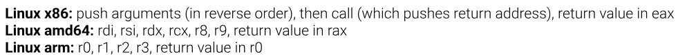

## Jumps

How do we make decisions in a program? We make these decisions with Control Flow. A CPU executes code by reading assembly instructions which are directly translated to machine code (i.e. binary code).

The CPU executes these instructions until explicitly told not to, and this "toldness" is done by jumps. By using the **jmp** instruction, the CPU will jump X bytes and then resume execution.

### Signed jumps

The X in "jump X bytes" is a **signed** displacement. 

A short `jmp` is encoded as two bytes: `EB` followed by one displacement byte. `EB` is the opcode for a short relative jump, and the byte after it is an 8-bit signed value, so it covers the range -128 to +127. Positive means jump forward, negative means jump backward. Without signedness, code could only ever move forward and there would be no way to return to an earlier instruction.

The displacement is also **relative**, measured from the address of the *next* instruction, not from the jump itself. By the time the CPU works out where to go, `rip` has already advanced past the two bytes of the `jmp`.

That gives the classic byte pair:

```
EB FE
```

`FE` as a signed 8-bit value is -2. The `jmp` instruction is 2 bytes long, so after decoding it `rip` points 2 bytes further on. Adding -2 puts `rip` back exactly at the start of the `EB FE` itself. The instruction jumps to itself, forever. This is the shortest infinite loop you can write on x86, and it is a common way to park a CPU or to hold a process still while you attach a debugger.

Longer jumps use `E9` with a 4-byte signed displacement, which covers roughly ±2 GB. The assembler picks whichever form fits.

---

## Conditional jumps

Similarly there exist conditional jumps. An example is **jnz**, which means jump if not zero. But what is "not zero"? The "what" is the last thing we checked.

More precisely it is the last instruction that **modified the flags**. There is no operand on `jnz`. It does not name what it is testing. It reads the flags register, and the flags register holds whatever the most recent flag-setting instruction left there.

```asm
mov rax, 5
sub rax, 5        ; result is 0, so the Zero Flag gets set
jnz not_zero      ; not taken, because ZF = 1
```

The `sub` is what `jnz` is reacting to. Nothing in the `jnz` line refers to `rax`.

**`mov` does not touch the flags at all**:

```asm
cmp rax, rbx      ; sets flags
mov rcx, 0        ; does NOT change flags
mov rdx, 7        ; also does NOT change flags
jnz somewhere     ; still reacting to the cmp, three instructions ago
```

This is fine and often deliberate. You can set up registers between the comparison and the jump. But it also means that if you insert an `add` or a `sub` in that gap by accident, the jump silently starts testing something else. When a conditional jump behaves strangely, the question to ask is "which instruction actually set the flags here".

---

## The flags register

Conditional jumps check conditions which are stored in special "flag" registers known as `rflags`.

`rflags` is one 64-bit register where individual bits mean individual things. Four of them carry almost all the weight:

| Flag | Name | Set when |
| --- | --- | --- |
| **ZF** | Zero Flag | the result was exactly zero |
| **SF** | Sign Flag | the most significant bit of the result was 1, i.e. negative if read as signed |
| **CF** | Carry Flag | the operation carried out of, or borrowed into, the most significant bit. This is **unsigned** overflow |
| **OF** | Overflow Flag | the result went outside the range representable as a **signed** value |

 PF (Parity Flag, set when the low byte has an even number of set bits) and AF (Auxiliary Carry, used for Binary Coded Decimal arithmetic).

### How flags get set: `cmp` and `test`

Two instructions exist purely to set flags.

**`cmp a, b`** performs `a - b` and throws the result away. It is `sub` with the write disabled. Everything else about it, including which flags it sets, is identical to `sub`.

**`test a, b`** performs `a AND b` and throws the result away. It is `and` with the write disabled. Because a bitwise AND cannot carry or overflow, `test` always clears CF and OF, and only ZF and SF carry information.

Ordinary arithmetic sets flags too. `add`, `sub`, `and`, `or`, `xor`, `shl`, `neg` all update the flags as a side effect of doing their real work, which is why `sub rax, 5` above was enough on its own. `inc` and `dec` are the exception, they update ZF, SF and OF but deliberately leave CF alone.

### Common patterns

| Pattern                           | What it asks                         |
| --------------------------------- | ------------------------------------ |
| `test rax, rax` then `jz`         | is `rax` zero?                       |
| `test rax, rax` then `js`         | is `rax` negative?                   |
| `test al, al` then `jz`           | is this byte the null terminator?    |
| `test rax, 1` then `jnz`          | is `rax` odd? (tests the lowest bit) |
| `cmp rax, rbx` then `je`          | are they equal?                      |
| `cmp BYTE PTR [rax], 0` then `je` | end of string?                       |
| `xor rax, rax`                    | zero the register *and* set ZF       |

### Signedness lives in the jump, not the comparison

**`cmp` has no idea whether values are signed.** The decision about how to read those flags is made entirely by the conditional jump.

| Comparison | Unsigned jump | Signed jump |
| --- | --- | --- |
| greater than | `ja` (above) | `jg` (greater) |
| greater or equal | `jae` | `jge` |
| less than | `jb` (below) | `jl` (less) |
| less or equal | `jbe` | `jle` |
| equal | `je` / `jz` | `je` / `jz` |
| not equal | `jne` / `jnz` | `jne` / `jnz` |

Equality is the one case where signedness is irrelevant, because two bit patterns are either identical or they are not. 

Internally, `ja` looks at CF and ZF, while `jg` looks at SF, OF and ZF. Concretely:

```asm
mov al, 0xFF
cmp al, 1
ja  taken       ; TAKEN.  0xFF unsigned is 255, which is above 1.
jg  taken       ; NOT taken.  0xFF signed is -1, which is not greater than 1.
```

**above/below** means unsigned, **greater/less** means signed.

---

## `setcc`: turning a flag into a value

In x86 assembly, comparisons are done with the `cmp` instruction. `cmp` compares two values by subtracting the second operand from the first. Crucially, **`cmp` doesn't store the result of the subtraction** but rather discards it. Consider the instruction:

```asm
cmp rdi, 42
```

This computes `rdi - 42`, but `rdi` isn't modified. Instead, the CPU sets the **Zero Flag** (ZF) if the result of the subtraction was zero (i.e. the two values were equal), thus ZF is set to 1. If the result is non-zero, ZF becomes 0.

Since we can't directly move flags into registers, we have to use special instructions that write a 0 or 1 to a destination based on the current flags. One example is `setz` (i.e. set if zero):

```asm
setz dil
```

This checks the Zero Flag and:

- If ZF = 1 (the values **were** equal, i.e., the subtraction result was zero), it writes `1` to `dil`.
- If ZF = 0 (the values were **not** equal), it writes `0` to `dil`.

The complementary instruction, `setnz` (i.e. set if not zero), does the opposite.

The register `dil` in this case is a byte-sized register. In order not to waste a full 64-bit register, `dil` is the lowest 8 **bits** of `rdi`, which is one byte. Remember that `rdi` is the value passed to the `exit` system call.

There is a whole family of these, one for every condition the jumps cover: `sete`/`setz`, `setne`/`setnz`, `setg`, `setl`, `seta`, `setb`, and so on. They all write exactly one byte, and only ever `0` or `1` depending on the value of the specific register. 

`setz dil` writes `dil` and leaves the upper 56 bits of `rdi` completely untouched. If `rdi` held garbage before, it still holds that garbage with a 0 or 1 pasted into the bottom byte. This is why the program below zeroes `rdi` first.

### Comparing `argc` against 42

```asm
.intel_syntax noprefix
.global _start
_start:

mov rdi, 0
cmp QWORD PTR [rsp], 42
setz dil
mov rax, 60
syscall
```

We used `QWORD PTR` as the same reason `BYTE PTR` was needed in the last module. `cmp [rsp], 42` has a memory operand and an immediate operand, and neither one implies a size. The assembler cannot tell whether you want to compare 1, 2, 4 or 8 bytes starting at that address, and `42` fits in all of them. The size directive resolves it. `QWORD` means 8 bytes, which is right here because `argc` is stored as a full 64-bit value at `[rsp]`.

A recap on the four size directives:

| Directive   | Bytes | Bits |
| ----------- | ----- | ---- |
| `BYTE PTR`  | 1     | 8    |
| `WORD PTR`  | 2     | 16   |
| `DWORD PTR` | 4     | 32   |
| `QWORD PTR` | 8     | 64   |

```console
ubuntu@control-flow~comparing-values:~$ ./build.sh pwn
Successfully built pwn!
ubuntu@control-flow~comparing-values:~$ /challenge/check pwn

Checking that your assembly compares argc against 42...
Your assembly looks correct!

Let's run your program with different numbers of arguments to check the comparison!

hacker@control-flow~comparing-values:/home/hacker$ pwn a a a [...41 a's...]
hacker@control-flow~comparing-values:/home/hacker$ echo $?
1

hacker@control-flow~comparing-values:/home/hacker$ pwn a a a
hacker@control-flow~comparing-values:/home/hacker$ echo $?
0

hacker@control-flow~comparing-values:/home/hacker$ pwn a a a [...43 a's...]
hacker@control-flow~comparing-values:/home/hacker$ echo $?
0

Your program correctly uses cmp and setz to compare argc against 42! Nice work!
```

41 arguments gives an exit status of 1, not 42 arguments. `argc` counts the program name as well, so 41 arguments means `argc` is 42. 

---

## Reading argument characters

Recall that `[rsp+16]` holds a *pointer* to `argv[1]`, the first command-line argument. To actually look at the argument text, you first need to load that pointer into a register:

```asm
mov rax, [rsp+16]
```

Now `rax` holds the address of the argument string. The first character of that string lives at `[rax]`, the second at `[rax+1]`, and so on (because every character is the size of a byte, which holds for ASCII).

Thus we can compare byte by byte accordingly to check whether a character is the same and so on.

`[rsp+16]` gets you the pointer, `[rax]` gets you the character.

### Comparing the first character

```asm
.intel_syntax noprefix
.global _start
_start:

mov rax, [rsp+16]
cmp BYTE PTR [rax], 'p'
setz dil
mov rax, 60
syscall
```

```console
hacker@control-flow~comparing-characters:/home/hacker$ pwn pwn
hacker@control-flow~comparing-characters:/home/hacker$ echo $?
1

hacker@control-flow~comparing-characters:/home/hacker$ pwn zzz
hacker@control-flow~comparing-characters:/home/hacker$ echo $?
0
```

Also note `mov rdi, 0` is missing from this version, while the previous program had it. It happens to work because `rdi` is zero at process start.

---

## Conditional jumps and labels

We can also make use of conditional jumps in cases where we want to take completely different actions depending on whether our values were equal. For example:

```asm
cmp BYTE PTR [rax], 'p'
jne fail
```

After the `cmp`, if the values were *not* equal, the CPU jumps to the location labeled `fail`. `jne` checks the Zero Flag (ZF) that `cmp` set: `jne` jumps when ZF = 0. There's also `je`, which does the opposite.

`fail` is a **label**, i.e. a name you give to a location in your code. These labels just mark a spot that jump instructions can refer to. You define a label by writing its name followed by a colon:

```asm
fail:
  mov rdi, 1
  mov rax, 60
  syscall
```

A label is purely an assembler concept. It occupies no bytes and generates no instruction. The assembler records "the name `fail` means this address" and substitutes the right displacement into every jump that mentions it. In the disassembly there is no trace of the label except in the symbol table, which is why stripped binaries show raw addresses instead.

```asm
.intel_syntax noprefix
.global _start
_start:

mov rax, [rsp+16]
cmp BYTE PTR [rax], 'p'
jne fail

mov rdi, 0
mov rax, 60
syscall

fail:
mov rdi, 1
mov rax, 60
syscall
```

```console
hacker@control-flow~conditional-control-flow:/home/hacker$ pwn pwn
hacker@control-flow~conditional-control-flow:/home/hacker$ echo $?
0
hacker@control-flow~conditional-control-flow:/home/hacker$ pwn abc
hacker@control-flow~conditional-control-flow:/home/hacker$ echo $?
1
```

The exit codes here are **inverted** relative to the `setz` version above. There, a match gave 1. Here, a match gives 0. Nothing is wrong: the `setz` version was reporting a boolean (1 = true), while this version is reporting a Unix exit status (0 = success). 

Structurally, `jne fail` is an `if` statement with the condition inverted. In C this is:

```c
if (argv[1][0] == 'p') { exit(0); } else { exit(1); }
```

The assembly jumps away when the condition is **false** and falls through when it is true. Compiled conditionals nearly always look like this, because falling through costs nothing and taking a jump costs something, so the common path is arranged to fall through.

---

## Comparing strings

To check strings, one can chain multiple `cmp` and `jne` pairs to manually check a string. An example usage is:

```asm
.intel_syntax noprefix
.global _start
_start:

mov rax, [rsp+16]
cmp BYTE PTR [rax], 'p'
jne fail
cmp BYTE PTR [rax+1], 'w'
jne fail
cmp BYTE PTR [rax+2], 'n'
jne fail

mov rdi, 0
mov rax, 60
syscall

fail:
mov rdi, 1
mov rax, 60
syscall
```

```console
hacker@control-flow~comparing-strings:/home/hacker$ pwn pwn
hacker@control-flow~comparing-strings:/home/hacker$ echo $?
0

hacker@control-flow~comparing-strings:/home/hacker$ pwn pwnage
hacker@control-flow~comparing-strings:/home/hacker$ echo $?
0

hacker@control-flow~comparing-strings:/home/hacker$ pwn xwn
hacker@control-flow~comparing-strings:/home/hacker$ echo $?
1
```

Every `jne` in the chain points at the same label. Multiple jumps can share a destination; a label is just an address.

---

## Reading a comparison chain out of a binary

This is the pattern in reverse: given a binary that does the above, recover the string it is checking for.

```console
ubuntu@control-flow~reverse-the-password:~$ gdb /challenge/reverse-me
...
(gdb) starti
...
Program stopped.
0x0000000000401000 in _start ()
(gdb) disassemble
Dump of assembler code for function _start:
=> 0x0000000000401000 <+0>:     mov    0x10(%rsp),%rax
   0x0000000000401005 <+5>:     cmpb   $0x65,(%rax)
   0x0000000000401008 <+8>:     jne    0x40107e <fail>
   0x000000000040100a <+10>:    cmpb   $0x76,0x1(%rax)
   0x000000000040100e <+14>:    jne    0x40107e <fail>
   0x0000000000401010 <+16>:    cmpb   $0x6e,0x2(%rax)
   0x0000000000401014 <+20>:    jne    0x40107e <fail>
   0x0000000000401016 <+22>:    cmpb   $0x73,0x3(%rax)
   0x000000000040101a <+26>:    jne    0x40107e <fail>
```

**This dump is AT&T syntax**.

| AT&T | Intel |
| --- | --- |
| `mov 0x10(%rsp),%rax` | `mov rax, [rsp+0x10]` |
| `cmpb $0x65,(%rax)` | `cmp BYTE PTR [rax], 0x65` |
| `movb $0x2f,(%rsp)` | `mov BYTE PTR [rsp], 0x2f` |
| `jmp *%rax` | `jmp rax` |

The rules: operands are **reversed** (source first, destination second), `%` prefixes registers, `$` prefixes immediates, and the size directive becomes an instruction suffix (`b` = byte, `w` = word, `l` = long/dword, `q` = quad).
Reading the four immediates as ASCII:

| Offset      | Byte   | Character |
| ----------- | ------ | --------- |
| `(%rax)`    | `0x65` | `e`       |
| `0x1(%rax)` | `0x76` | `v`       |
| `0x2(%rax)` | `0x6e` | `n`       |
| `0x3(%rax)` | `0x73` | `s`       |

---

## Jump tables

There's a more efficient approach: a **jump table**. A jump table is an array of addresses stored in memory, one for each possible destination (called a **case**). Instead of comparing the input against every possibility, the program uses the input value as an *index* into the table, loads the address stored at that position, and jumps to it.

This pattern is called a **switch**, and it is the same thing as a `switch` statement in Java or C. Writing:

```java
switch (c) {
    case 'a': doA(); break;
    case 'b': doB(); break;
    default:  fail();
}
```

A jump table costs one memory load and one jump, regardless of how many cases there are.

The catch is memory. A table needs an entry for **every** index in the range it covers, including all the ones that just go to `default`. 
### Reading a jump table out of a binary

```console
(gdb) starti
...
0x0000000000401000 in _start ()
(gdb) disassemble
Dump of assembler code for function _start:
=> 0x0000000000401000 <+0>:     mov    0x10(%rsp),%rcx
   0x0000000000401005 <+5>:     xor    %eax,%eax
   0x0000000000401007 <+7>:     mov    (%rcx),%al
   0x0000000000401009 <+9>:     mov    0x401088(,%rax,8),%rax
   0x0000000000401011 <+17>:    jmp    *%rax
End of assembler dump.
```

In Intel syntax:

```asm
mov rcx, [rsp+0x10]           ; rcx = argv[1]
xor eax, eax                  ; rax = 0
mov al, [rcx]                 ; al = first byte of argv[1]
mov rax, [0x401088 + rax*8]   ; rax = the table entry for that byte
jmp rax                       ; go there
```

**`[0x401088 + rax*8]`** is the scaled-index addressing mode. The general form is `[base + index*scale + displacement]`, where scale can only be 1, 2, 4 or 8. Here there is no base register, the displacement is the table's address, the index is the character, and the scale is 8 because each entry is an 8-byte address.

**`jmp rax`** is an indirect jump, jumping to whatever address is in the register.
Dumping the table:

```console
(gdb) x/256a 0x401088
0x401088 <jump_table>:  0x401078 <fail> 0x401078 <fail>
0x401098 <jump_table+16>:       0x401078 <fail> 0x401078 <fail>
...
0x401428 <jump_table+928>:      0x401078 <fail> 0x401013 <success>
...
0x401878 <jump_table+2032>:     0x401078 <fail> 0x401078 <fail>
```

`x/256a` reads 256 values in address format. GDB prints two per line, and the label on the left is the offset of the **first** of the two.

Finding the one entry that is not `fail`: it is on the row labelled `jump_table+928`, in the **second** column.

- First column of that row is at offset 928.
- Second column is 8 bytes further on, so offset 936.
- Each entry is 8 bytes, so the index is 936 / 8 = 117.
- 117 decimal is 0x75, which is ASCII `u`.

So the byte the program accepts is `u`. 

---

## Loops

Using these conditional jumps, we can make loops.

`jmp` **unconditionally** always jumps. An example of a loop is:

```asm
loop:
  mov    al, BYTE PTR [rsi]       ; load next password character
  cmp    al, BYTE PTR [rdi]       ; compare against next argv[1] character
  jne    fail                     ; mismatch → jump to fail
  cmp    al, 0x0                  ; reached the null terminator?
  je     success                  ; yes → all characters matched!
  inc    rdi                      ; **inc**rement rdi to advance to next argv[1] character
  inc    rsi                      ; **inc**rement rsi to advance to next password character
  jmp    loop                     ; jump back to the top
```

This is the fundamental pattern behind every `for` loop, `while` loop, and string operation.

The loop above puts its tests in the middle, so the bottom has to be an unconditional `jmp` back. But a loop with its test at the bottom ends with a **conditional** jump backward and needs no `jmp` at all. 

### The three shapes

**`for` loop.** Counter initialised before the loop, tested at the top, incremented at the bottom.

```asm
    mov rcx, 0              ; for (rcx = 0;
for_top:
    cmp rcx, 10             ;      rcx < 10;
    jge for_done
    ; ... body ...
    inc rcx                 ;      rcx++)
    jmp for_top
for_done:
```

Note `jge`, the signed form. If `rcx` could ever hold something that looks negative, `jae` would behave differently.

**`while` loop.** Same structure, condition is not a counter. The test is at the top, so the body may run zero times.

```asm
while_top:
    cmp BYTE PTR [rsi], 0   ; while (*rsi != 0)
    je  while_done
    ; ... body ...
    inc rsi
    jmp while_top
while_done:
```

**`repeat ... until`, or `do ... while`.** The test is at the bottom, so the body always runs at least once.

```asm
repeat_top:
    ; ... body ...
    inc rsi
    cmp BYTE PTR [rsi], 0
    jne repeat_top          ; until (*rsi == 0)
```

This is the shape with no `jmp` in it. 

---

## Recognising a loop in a binary

```console
(gdb) disassemble
Dump of assembler code for function _start:
=> 0x0000000000401000 <+0>:     mov    0x10(%rsp),%rdi
   0x0000000000401005 <+5>:     movb   $0x32,(%rsp)
   0x0000000000401009 <+9>:     movb   $0x51,0x1(%rsp)
   0x000000000040100e <+14>:    movb   $0x52,0x2(%rsp)
   0x0000000000401013 <+19>:    movb   $0x4c,0x3(%rsp)
   0x0000000000401018 <+24>:    movb   $0x64,0x4(%rsp)
   0x000000000040101d <+29>:    movb   $0x65,0x5(%rsp)
   0x0000000000401022 <+34>:    movb   $0x0,0x6(%rsp)
   0x0000000000401027 <+39>:    lea    (%rsp),%rsi
End of assembler dump.
```

| Offset | Byte | Character |
| --- | --- | --- |
| `(%rsp)` | `0x32` | `2` |
| `+1` | `0x51` | `Q` |
| `+2` | `0x52` | `R` |
| `+3` | `0x4c` | `L` |
| `+4` | `0x64` | `d` |
| `+5` | `0x65` | `e` |
| `+6` | `0x00` | terminator |

`lea (%rsp),%rsi` is `lea rsi, [rsp]` in Intel, which computes the address `rsp` and stores it, making it functionally identical to `mov rsi, rsp`. 

The structural point: this program does **not** contain a chain of `cmp`/`jne` pairs. It sets up two pointers, `rdi` at `argv[1]` and `rsi` at the stack string, and the rest is a loop, exactly the pattern above. 

---

## Writing a loop, string length

```asm
.intel_syntax noprefix
.global _start
_start:

main:
mov rsi, 0
mov rax, [rsp+16]

loop:
mov cl, BYTE PTR [rax]     # load one character from the argument
cmp cl, 0x0                # reached null terminator
je success                 # exit if we hit the string terminator
inc rsi                    # increase counter
inc rax                    # else advance and keep going
jmp loop

success:
mov rdi, rsi
mov rax, 60
syscall

fail:
mov rdi, 1
mov rax, 60
syscall
```

| Instruction                 | Effect on `rcx`                                             |
| --------------------------- | ----------------------------------------------------------- |
| `mov cl, BYTE PTR [rax]`    | writes the low byte, **leaves the other 56 bits untouched** |
| `movzx rcx, BYTE PTR [rax]` | writes the byte and zeroes the rest                         |
| `movsx rcx, BYTE PTR [rax]` | writes the byte and sign-extends it into the rest           |


```console
hacker@control-flow~writing-loops:/home/hacker$ pwn ''
hacker@control-flow~writing-loops:/home/hacker$ echo $?
0

hacker@control-flow~writing-loops:/home/hacker$ pwn pwn
hacker@control-flow~writing-loops:/home/hacker$ echo $?
3

hacker@control-flow~writing-loops:/home/hacker$ pwn 'two words'
hacker@control-flow~writing-loops:/home/hacker$ echo $?
9

hacker@control-flow~writing-loops:/home/hacker$ pwn 'M'"'"''
hacker@control-flow~writing-loops:/home/hacker$ echo $?
2
```

---

## Functions

Assembly code is split into functions, with `call` and `ret`.

- `call` pushes the return address and jumps away
- `ret` pops it and jumps back

A complete executable always starts at `_start`, runs from there, and exits with a syscall. 

A shared library (called a `.so` file on Linux) is a chunk of compiled code that some *other* program loads at runtime and calls into. Thus our code is the callee (i.e. being called) and the program that is calling our code is known as the caller.

For a program to call a function, it makes use of the `call` instruction. `call <target>` is x86's function-call instruction:

1. Pushes the address of the next instruction after the `call` instruction (the *return address*) onto the stack.
2. Jumps to `<target>`.

(To be precise about the wording: the caller and callee here are not two separate programs. Once the library is loaded they are one process sharing one address space and one stack. `call` is not a system call and the kernel is not involved.)

Similar to our other programs, we start this program with the following prefix:

```asm
.intel_syntax noprefix
.global solve
solve:
    <your code, ending in an exit syscall>
```

The `.global solve`, similar to `.global _start`, tells the assembler to allow this code to be found by other programs..

To build a shared library, we follow the same pattern to assemble our program, but when linking, we pass the `-shared` flag:

```console
hacker@dojo:~$ as -o your-solve.o your-solve.s
hacker@dojo:~$ ld -shared -o your-solve.so your-solve.o
```

`-shared` produces a library with no entry point rather than an executable. A `.so` is not runnable on its own; something has to load it and call into it.

### The calling convention

The arguments arrive in registers, and it is nearly the same convention as syscalls with one difference:

| | Syscall | Function call |
| --- | --- | --- |
| selector | `rax` = syscall number | not applicable |
| arg 1 | `rdi` | `rdi` |
| arg 2 | `rsi` | `rsi` |
| arg 3 | `rdx` | `rdx` |
| arg 4 | `r10` | **`rcx`** |
| arg 5 | `r8` | `r8` |
| arg 6 | `r9` | `r9` |
| return | `rax` | `rax` |

The fourth argument is the only difference, and the reason is the one from the last module: the `syscall` instruction clobbers `rcx`, so the syscall convention had to move that slot to `r10`.

### Worked example, writing from a shared library

The harness calls `solve(flag_buffer, length)`, so `rdi` is the buffer address and `rsi` is the length. Both need to end up as arguments to `write(1, buffer, length)`, which wants `rdi = 1`, `rsi = buffer`, `rdx = length`.

Every argument has to move one slot to the right.

First version, going via scratch registers:

```asm
.intel_syntax noprefix
.global solve
solve:

mov rcx, rdi    # Save the buffer pointer safely into rcx
mov r10, rsi    # Save the flag length safely into r10

mov rdi, 1      # Set fd to 1 (stdout)
mov rsi, rcx    # Move the buffer pointer from rcx to rsi
mov rdx, r10    # Move the flag length from r10 to rdx

mov rax, 1      # syscall number for write
syscall

mov rdi, 0      # exit code 0
mov rax, 60     # syscall number for exit
syscall
```

Better version, with no scratch registers at all:

```asm
.intel_syntax noprefix
.global solve
solve:

mov rdx, rsi    # rsi is now free
mov rsi, rdi    # rdi is now free
mov rdi, 1
mov rax, 1
syscall

mov rdi, 0
mov rax, 60
syscall
```

When shuffling values between registers, **move a register only after everything that needs its current value has read it**. 

```console
[harness] loading shared library /tmp/your-program.so ...
[harness] resolving `solve` symbol ...
[harness] found solve at 0x73186b0cd000
[harness] calling solve(<60-byte flag buffer>, 60) --- your code should write those bytes to stdout:
```

`resolving 'solve' symbol` is the `.global` line doing its job. The address `0x73186b0cd000` is nowhere near the `0x401000` of the earlier static binaries, because a shared library is position-independent and gets mapped wherever the loader chooses. 

---

## `ret`

In the above example, our `solve` function ended with an `exit` syscall. This means however that the caller never gets control back. Callees are always supposed to hand control back to whoever called them. That's what the **`ret`** (return) instruction is for. When the caller makes use of the `call` instruction it pushes a return address onto the stack before it jumps to the callee code. `ret` is the other half of `call`: it pops that saved return address off the stack and jumps to it. In the Linux x86-64 calling convention, the return value of a function goes in `rax`.

```asm
.intel_syntax noprefix
.global solve
solve:

mov rax, rdi
ret
```

Two instructions, and both halves of the convention are visible: the argument arrives in `rdi`, the return value leaves in `rax`.

```console
[harness] calling solve(0xcdc3130400c40771) --- your code should return that value back unchanged in rax
[harness] solve() returned 0xcdc3130400c40771
[harness] match! return value == secret.
```

The thing to understand about `ret` is that it has **no operand and no memory of where it came from**. It pops 8 bytes off the top of the stack and jumps to whatever address those bytes contain. It does not verify anything. If the stack pointer is not where `ret` expects it, or if the saved return address has been overwritten, `ret` jumps to whatever is there instead.

---

## Calling through a pointer

```console
[harness] calling solve(callback) --- your code receives the callback in rdi
[harness] the callback prints the flag if you call it with rdi == 1337, or a hint otherwise:
```

```asm
.intel_syntax noprefix
.global solve
solve:

mov rax, rdi    # moving the callback pointer out of rdi into rax
mov rdi, 1337   # rdi now holds the callback's own first argument
call rax        # indirect call: jump to the address in rax
mov rdi, 0
mov rax, 60
syscall
```

The confusing part is that `rdi` is doing two completely different jobs, and the whole problem is that it cannot do both at once.

**Job one.** The harness calls `solve(callback)`. By the calling convention, the first argument arrives in `rdi`. But the argument is a **function pointer**, so `rdi` does not hold data here. It holds the address of some code somewhere in the harness.

**Job two.** You now have to call that function with the argument 1337. By the same calling convention, the callback's first argument also has to be in `rdi`.

So the register that currently holds "where to go" is the same register that has to hold "what to pass". Writing `mov rdi, 1337` first would overwrite the pointer with 1337 and you would have nowhere to jump to. Writing `call rdi` first would call it with the pointer as its own argument, which is not 1337.

The fix is one instruction: get the pointer out of `rdi` before overwriting it. `rax` is a fine place, because it is caller-saved and holds nothing important yet.

---

## Caller-saved and callee-saved registers



Since there are only a limited number of registers that programs can use, there are thus two types of registers:

- **caller-saved** registers may be freely overwritten by any function you call. If you have a value in one of these that you need *after* a call, it's the caller's job to save it first and restore it afterward. Typically, this is done by `push`ing them to the stack before calling the callee and `pop`ping them off the stack later. On x86-64, these registers are `rax`, `rcx`, `rdx`, `rsi`, `rdi`, `r8`, `r9`, `r10`, `r11`.
- **callee-saved** registers must be left untouched by the functions you call. Rather, callees can touch them, but they must restore them back to their original state. On x86-64, these are `rbx`, `rbp`, `r12`, `r13`, `r14`, `r15`.

The reason this split exists at all is that there is no way for a caller and a callee to negotiate at runtime. Neither one can see the other's source. The convention is a fixed contract that lets both sides be compiled independently, and everything that follows it can interoperate.

The way to keep the two straight is to ask **whose job it is to do the saving**:

| | Caller-saved (volatile) | Callee-saved (non-volatile) |
| --- | --- | --- |
| Registers | `rax`, `rcx`, `rdx`, `rsi`, `rdi`, `r8`–`r11` | `rbx`, `rbp`, `r12`–`r15` |
| Assume after a call | destroyed | unchanged |
| If you're the caller | save it yourself before calling | do nothing |
| If you're the callee | use freely | save and restore, or don't touch it |
| Typical use | arguments, return value, scratch | long-lived values held across calls |

The argument registers are all caller-saved, and that follows naturally: their whole purpose is to be handed to the callee, so the callee is expected to consume them.

`rsp` is in neither category. It is special: a function must leave it exactly as it found it, because that is what `ret` depends on. `rbp` is nominally callee-saved and is conventionally the frame pointer, though modern compilers often use it as a general register with `-fomit-frame-pointer`.

### Saving caller-saved registers around a call

```asm
.intel_syntax noprefix
.global solve
solve:

push rax
push rdi
push rsi
push rcx
push rdx
push r8
push r9
push r10
push r11
call rdi
pop r11
pop r10
pop r9
pop r8
pop rdx
pop rcx
pop rsi
pop rdi
pop rax
call rsi
ret
```

The pops are in exact reverse order of the pushes. The stack is LIFO.
### Saving callee-saved registers

```asm
.intel_syntax noprefix
.global solve
solve:

push rbx
push rbp
push r12
push r13
push r14
push r15
mov rbx, 0x1337
mov rbp, 0x1337
mov r12, 0x1337
mov r13, 0x1337
mov r14, 0x1337
mov r15, 0x1337
call rdi
pop r15
pop r14
pop r13
pop r12
pop rbp
pop rbx
ret
```

---

## Instruction reference

| Instruction               | What it does                                              |
| ------------------------- | --------------------------------------------------------- |
| `jmp label`               | unconditional jump                                        |
| `jmp rax`                 | indirect jump, destination read from a register           |
| `je` / `jz`               | jump if equal / zero (ZF = 1)                             |
| `jne` / `jnz`             | jump if not equal / not zero (ZF = 0)                     |
| `ja`, `jae`, `jb`, `jbe`  | **unsigned** ordering comparisons                         |
| `jg`, `jge`, `jl`, `jle`  | **signed** ordering comparisons                           |
| `js` / `jns`              | jump if sign flag set / clear                             |
| `cmp a, b`                | `a - b`, discard result, set flags                        |
| `test a, b`               | `a AND b`, discard result, set flags                      |
| `setz dil` etc.           | write 1 or 0 into a **byte** register based on a flag     |
| `inc` / `dec`             | add or subtract 1; do not affect CF                       |
| `movzx r64, BYTE PTR [x]` | load a byte, zero-extend into the full register           |
| `movsx r64, BYTE PTR [x]` | load a byte, sign-extend into the full register           |
| `lea rsi, [rsp]`          | compute an address without touching memory                |
| `call label` / `call rax` | push return address, jump                                 |
| `ret`                     | pop return address, jump to it                            |
| `push` / `pop`            | save and restore a register via the stack                 |
| `xor eax, eax`            | zero a full 64-bit register (32-bit writes clear the top) |


---

